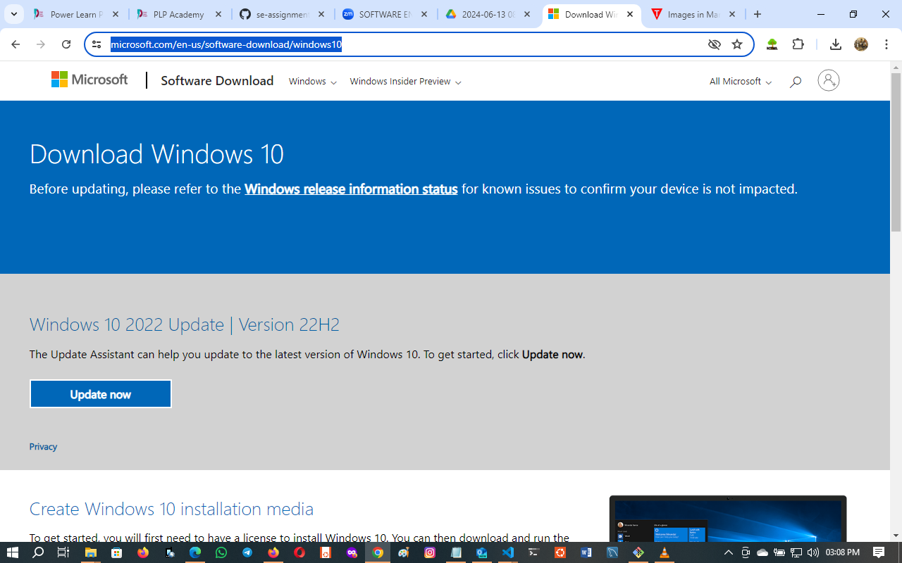
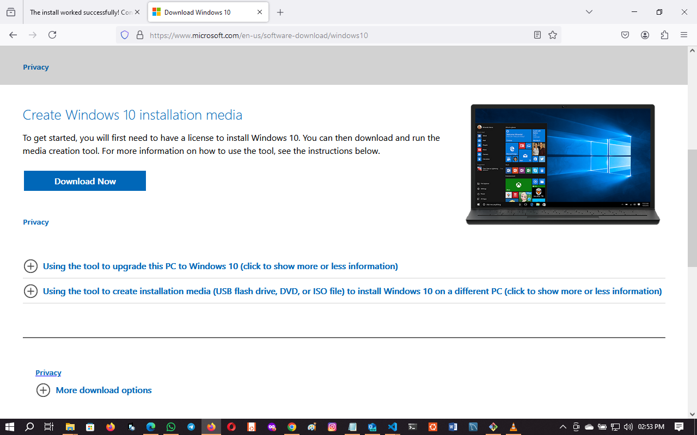
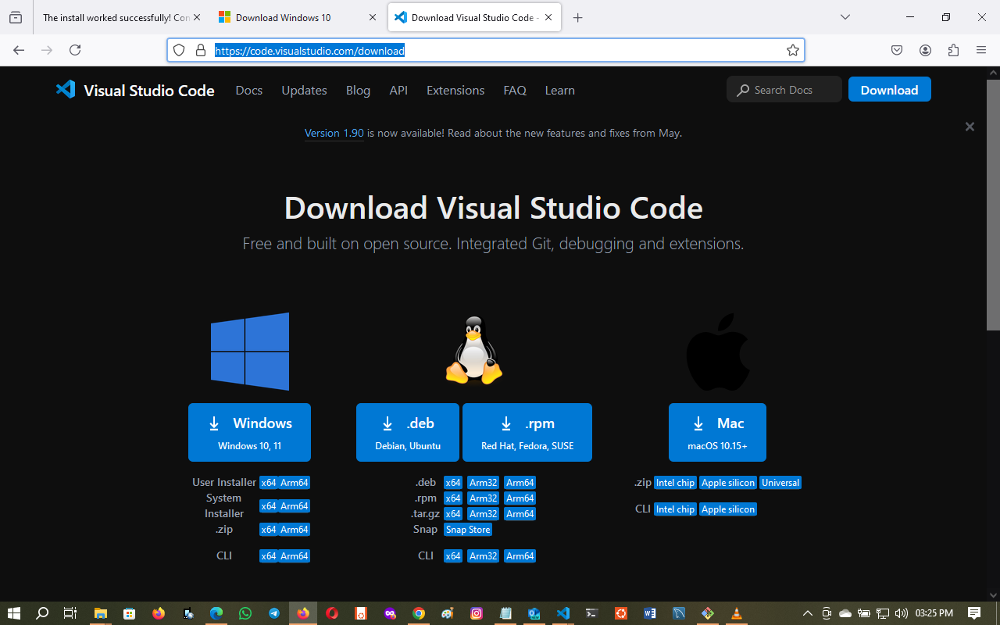
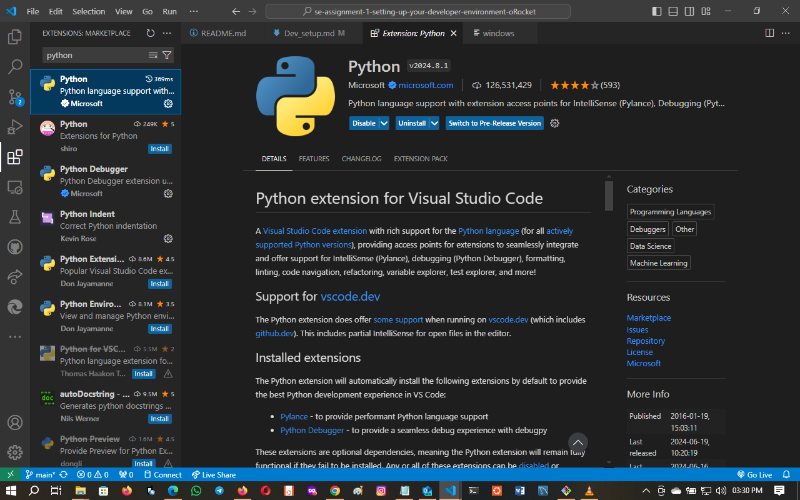
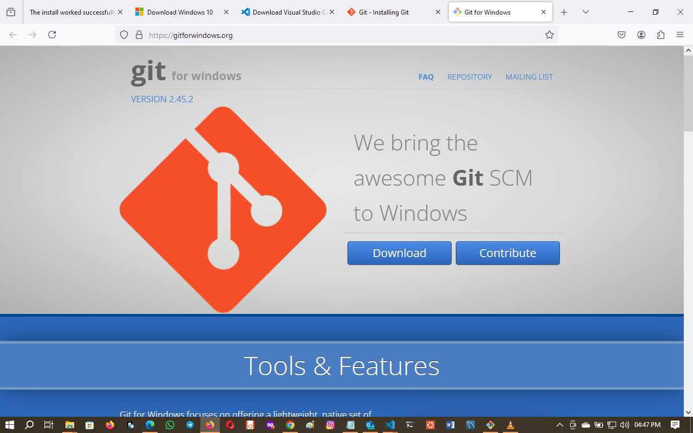
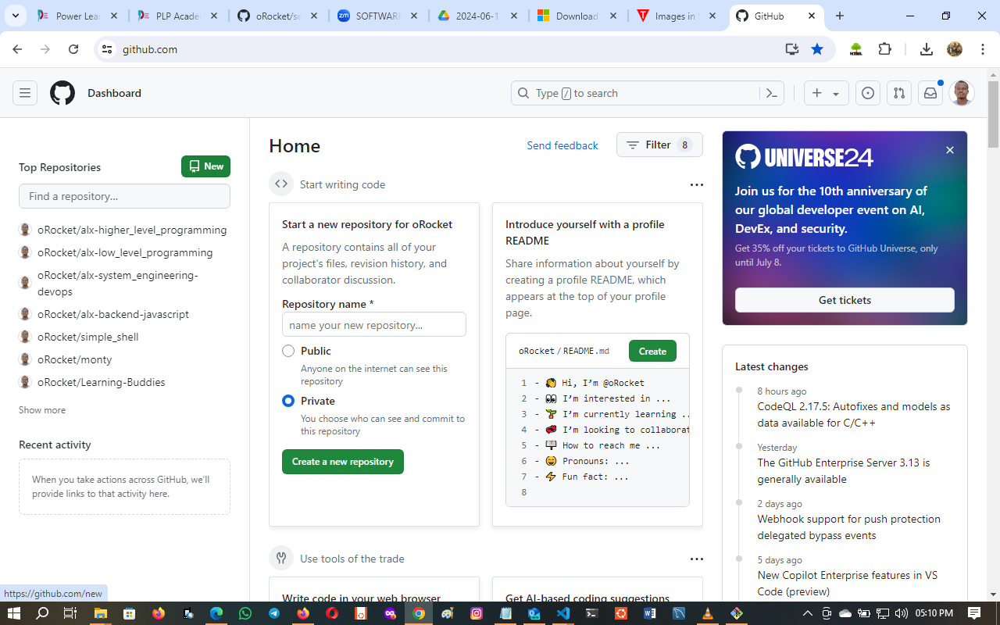
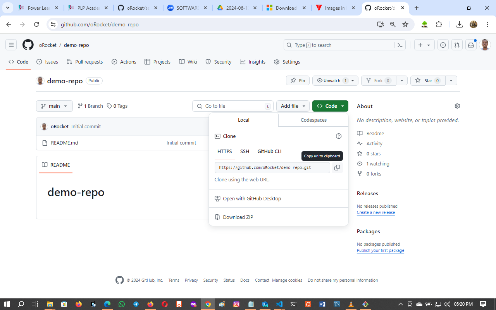
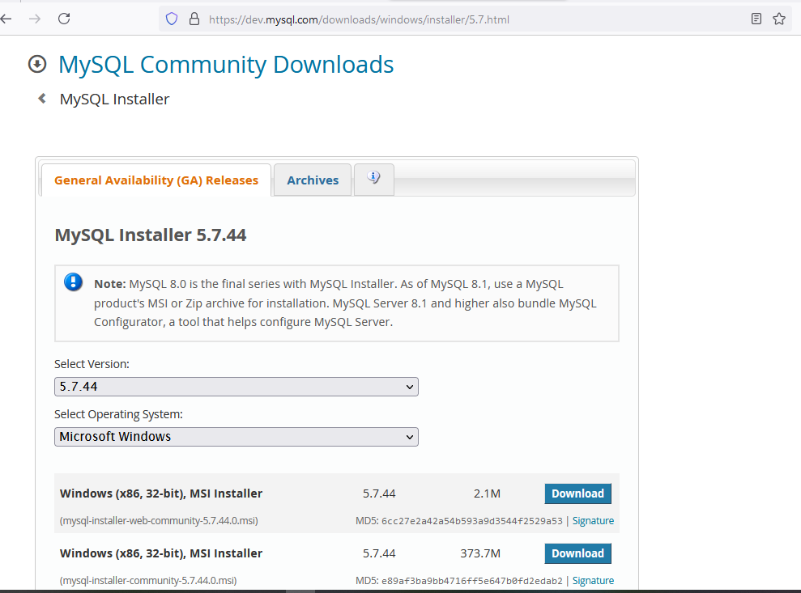

# Document detailing the setup process with step-by-step instructions

## Operating System (OS)
1. **Prepare for Installation of Windows 10**
    - 1.1 System Requirements
        - Processor: 1 GHz or faster compatible processor
        - RAM: 1 GB for 32-bit or 2 GB for 64-bit
        - Hard Disk Space: 16 GB for 32-bit OS or 20 GB for 64-bit OS
        - Graphics Card: DirectX 9 or later with WDDM 1.0 driver
        - Display: 800x600

    - 1.2 Backup Important Data
        - Backup all important files and data to an external drive or cloud storage.

2. **Create a Bootable USB Drive**
    - 2.1 Download Windows 10 ISO
        - Download the Windows 10 ISO file from the official Microsoft website.
        ```
        https://www.microsoft.com/en-us/software-download/windows10
        ```
        

    - 2.2 Create Bootable USB
        - Use the Windows Media Creation Tool or a third-party tool like Rufus to create a bootable USB drive.
        - Using Windows Media Creation Tool:
        - Download the Media Creation Tool from the Microsoft website.
        - Run the tool and select "Create installation media (USB flash drive, DVD, or ISO file) for another PC".
        - Select the language, edition, and architecture (64-bit or 32-bit).
        - Choose "USB flash drive" and follow the prompts to create the bootable USB drive.
        

3. **Install Windows 10**
    - 3.1 Boot from USB Drive
        - Insert the bootable USB drive into the computer.
        - Restart the computer and enter the BIOS/UEFI settings (commonly done by pressing a key like F2, F12, DEL, or ESC during startup).
        - Change the boot order to prioritize the USB drive.
        - Save changes and exit the BIOS/UEFI settings.
    - 3.2 Start Windows 10 Installation
        - The computer should boot from the USB drive and display the Windows Setup screen.
        - Select your language, time and currency format, and keyboard or input method, then click "Next".
        - Click "Install now".
    - 3.3 Enter Product Key
        - Enter your Windows 10 product key. If you don't have one, you can choose "I don't have a product key" and enter it later.
        - Select the Windows 10 edition you have a license for and click "Next".
    - 3.4 Accept License Terms
        - Read the license terms, check the box to accept them, and click "Next".
    - 3.5 Choose Installation Type
        - Select "Custom: Install Windows only (advanced)" to perform a clean installation.
    - 3.6 Select Partition
        - Choose the partition where you want to install Windows 10. If you're performing a clean installation, you can delete existing partitions and create a new one.
        - Select the partition and click "Next". The installation will begin.

4. **Complete Installation**
    - 4.1 Initial Setup
        - The computer will restart several times during the installation process.
        - Follow the on-screen instructions to set up your region, keyboard layout, and time zone.
    - 4.2 Connect to a Network
        - Connect to a Wi-Fi or Ethernet network to continue the setup.
    - 4.3 Set Up Account
        - Sign in with a Microsoft account or create a local account.
        - Set up a password and security questions.
    - 4.4 Privacy Settings
        - Choose your privacy settings for things like location, diagnostics, and tailored experiences.
    - 4.5 Finish Setup
        - Customize additional settings if prompted, or choose the default settings.
        - Windows will finalize the setup and bring you to the desktop.

5. **Post-Installation Steps**
    - 5.1 Install Updates
        - Go to Settings > Update & Security > Windows Update and check for updates. Install all available updates.
    - 5.2 Install Drivers
        - Install drivers for your hardware components. You can usually download these from the manufacturer's website.
    - 5.3 Install Essential Software
        - Install essential software and applications you need for daily use.
    - 5.4 Restore Data
        - Restore your backed-up data to your new Windows 10 installation.
        
**Conclusion**
Following these steps should help you successfully install Windows 10 on your computer.

## Installation of Visual Studio Code
1. **Download VS Code**
    - Go to the Visual Studio Code download page.
    ```
    https://code.visualstudio.com/download
    ```
    
    - Choose the appropriate version for the above operating system (Windows).

2. **Install VS Code**
    - Run the downloaded .exe file.
    - Follow the installation wizard:
    - Accept the license agreement.
    - Choose the installation location.
    - Select additional tasks (e.g., creating a desktop icon).
    - Click "Install" and then "Finish" once the installation is complete.

3. **Launch VS Code**
    - Use the Start menu or double-click the desktop icon.

4. **Install Extensions**
    - Open VS Code
    - Click on the Extensions icon in the Activity Bar on the side of the window or press Ctrl+Shift+X (Windows/Linux) or Cmd+Shift+X (macOS).
    - Search for extensions you need (like Python, JavaScript, etc.).
    - Click "Install" on the desired extensions.
    


## Installation Git and Git Bash for Windows 10
1. **Download Git**:
    - Go to the Git download page.
    ```
    https://gitforwindows.org/
    ```
    

    **Install Git**:
    - Run the downloaded installer.
    - Follow the installation wizard, leaving the default settings unless you need specific configurations.

2. **Configure Git**
    - Open Git Bash:
    Search for "Git Bash" in the Start menu.
    - Set Your Username and Email:
    ```
    git config --global user.name "Your Name"
    git config --global user.email "youremail@example.com"
    ```

3. **Create a GitHub Account**
    - Sign Up:
        - Go to GitHub.
        ```
        https://github.com/
        ```
        
        - Click "Sign up" and follow the instructions to create an account.

4. **Initialize a Git Repository and Make Your First Commit**
    - Create a New Repository on GitHub:
        - Go to your GitHub account.
        - Click on "New" or select "New repository".
        
        - Name your repository and click "Create repository".
        - Write description (optional)
        - Add a README file
        - Click on "create repository"
        
        - Copy `url` for repository
        `https://github.com/oRocket/demo-repo.git`
        
    
    - Navigate to Your Project Directory using git bash:
    ```
    Albert@DESKTOP-GB4MVIN MINGW64 ~
    $ cd desktop

    Albert@DESKTOP-GB4MVIN MINGW64 ~/desktop (master)
    $ mkdir myFirstDirectory

    Albert@DESKTOP-GB4MVIN MINGW64 ~/desktop (master)
    $ cd myFirstDirectory

    Albert@DESKTOP-GB4MVIN MINGW64 ~/desktop/myFirstDirectory (master)
    $
    ```
    - Clone into your repository:
    ```
    Albert@DESKTOP-GB4MVIN MINGW64 ~/desktop/myFirstDirectory (master)
    $ git clone https://github.com/oRocket/demo-repo.git
    Cloning into 'demo-repo'...
    remote: Enumerating objects: 3, done.
    remote: Counting objects: 100% (3/3), done.
    remote: Total 3 (delta 0), reused 0 (delta 0), pack-reused 0
    Receiving objects: 100% (3/3), done.

    Albert@DESKTOP-GB4MVIN MINGW64 ~/desktop/myFirstDirectory (master)
    $

    Albert@DESKTOP-GB4MVIN MINGW64 ~/desktop/myFirstDirectory (master)
    $ ls
    demo-repo/

    Albert@DESKTOP-GB4MVIN MINGW64 ~/desktop/myFirstDirectory (master)
    $ cd demo-repo/

    Albert@DESKTOP-GB4MVIN MINGW64 ~/desktop/myFirstDirectory/demo-repo (main)
    $ ls
    README.md

    Albert@DESKTOP-GB4MVIN MINGW64 ~/desktop/myFirstDirectory/demo-repo (main)
    $
    ```
    - Write your code
    ```
    Albert@DESKTOP-GB4MVIN MINGW64 ~/desktop/myFirstDirectory/demo-repo (main)
    $ vim README.md
    ```

    - Commit Your Changes:
    ```
    Albert@DESKTOP-GB4MVIN MINGW64 ~/desktop/myFirstDirectory/demo-repo (main)
    $ git add .

    Albert@DESKTOP-GB4MVIN MINGW64 ~/desktop/myFirstDirectory/demo-repo (main)
    $ git commit -m "My first commit message"
    [main d6c30b3] My first commit message
    1 file changed, 3 insertions(+), 1 deletion(-)

    Albert@DESKTOP-GB4MVIN MINGW64 ~/desktop/myFirstDirectory/demo-repo (main)
    $ git push
    ```

## installation of Python 
1. **Download Python**
   - Go to the official Python website.
   ```
   https://www.python.org/
   ```
   
   - Click on the "Downloads" tab.
   - Choose the version you want to download (the latest stable version is recommended).

2. **Install Python for Windows**
   - Run the downloaded installer.
   - Check the box that says "Add Python to PATH".
   - Click "Install Now".
   - Follow the prompts to complete the installation.

3. **Verify the Installation**
    - Open a command prompt or terminal.
    - Check the Python version
    ```
    python --version
    ```
    

4.  **Install pip (Python Package Installer)**
    - Ensure pip is installed by running:
    ```
    python -m ensurepip --upgrade
    ```

5. **Install a Virtual Environment**
    - Install virtualenv
    ```
    python -m pip install virtualenv
    ```

6. **Create a virtual environment:**
    ```
    python -m venv myenv
    ```

7. **Activate the virtual environment**
    ```
    source myenv\Scripts\activate
    ```

8. **Deactivate virtual environment**
    ```
    deactivate
    ```

## Installation of MySql
1. Download MySQL
    - Go to the MySQL from:
    - `https://dev.mysql.com/downloads/windows/installer/5.7.html`
    
    - Click on "MySQL Installer for Windows".
    - Choose the "Windows (x86, 32-bit), MSI Installer" or the "Windows (x86, 64-bit), MSI Installer" based on your system.
    - Click "Download" and then "No thanks, just start my download" if you don't want to create an Oracle Web account.
    
2. Install MySQL
    - Run the downloaded MySQL Installer `.msi` file.

    - In the setup window, choose the setup type:

    - Developer Default: Installs the `MySQL server` and other required tools for development.
    - Server only: Installs only the `MySQL server`.
    - Custom: Allows you to choose the specific components to install.
    - Click `"Next"` and then `"Execute"` to download and install the necessary components.

3. Configure MySQL
    - Once installation is complete, the `MySQL Installer` will guide you through configuration.

    - Choose the type of MySQL server you want to configure:

        - Standalone MySQL Server: For most single-machine setups.
        - InnoDB Cluster: For more complex setups with high availability.
        - Click `"Next"` and follow the steps to configure the server:

    - Server Configuration:
        - Choose "Development Computer" for minimal memory usage.
        - Leave the default port (3306) unless you have a reason to change it.
    - Authentication Method:
        - Choose "Use Strong Password Encryption".
    - Accounts and Roles:
        - Set the root password.
        - (Optional) Create additional user accounts.
    - Windows Service:
        - Ensure `"Configure MySQL Server as a Windows Service"` is checked.
        - Choose the service name (default is fine).
        - Start the `MySQL Server` at system startup.
        - Click `"Next"` and then `"Execute"` to apply the configuration.

4. Complete the Installation
    - Once the configuration is applied, click `"Finish"`.
    - Optionally, the installer may ask if you want to open MySQL Workbench and MySQL Shell. These are useful tools for managing and using your MySQL server.

5. Verify the Installation
    - Open a command prompt.
    - Connect to the MySQL server using the MySQL client:
    ```
    mysql -u root -p
    ```
    - Enter the root password you set during configuration.
    - You should now be at the MySQL prompt. You can run SQL commands here to ensure everything is working.